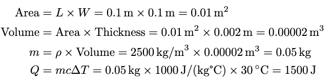
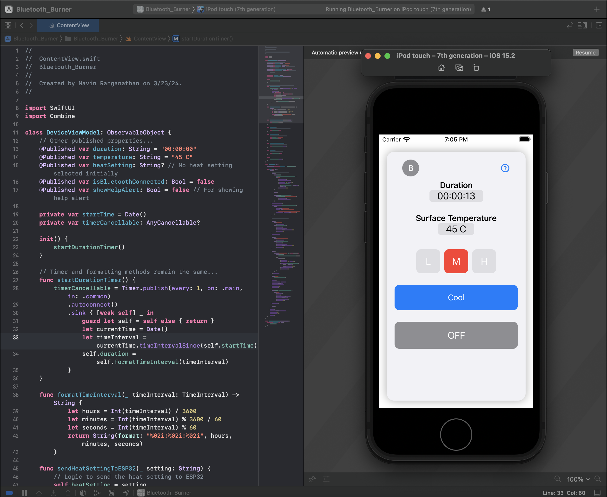
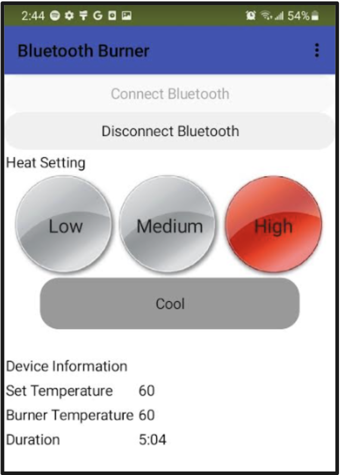

## Week 1 (2/5)
Objective of the Week: Build off of our initial project proposal post and complete our RFA Proposal

Tasks Accomplished:
- Met with my team members, Varun and Shaunak, to work on completing RFA in a timely and satisfactory manner
- Also met with our TA, Zicheng Ma, for our first weekly meeting to discuss important details for our semester such as lab notebooks, deadlines, and goals for our project
- Worked on understanding requirements and design specifications for the sensor and software subsystems of our product
- Worked on a tolerance analysis using specific heat capacity equation (as follows):

## Week 2 (2/12)

Objective of the Week: Beginning the final draft of our design document highlighting design schematics, requirements and verifications, and cost analysis 

Tasks Accomplished:
- In our weekly meeting with TA Zicheng, we received feedback and discussed things to build off of from our RFA Proposal as we continued to work on our design document
- Assisted in creating the sensor schematic, finding our parts and details regarding labor costs, fine-tuning our high-level requirements as it pertains to our product design goals.

## Week 3 (2/19)
Objective of the Week: Complete the design document, start guaging how to go about PCB schematic and implementation of key subsystem components

Tasks Accomplished:
- Finished our final list for part orders and began looking into PCB design
- Met with TA Zicheng to address questions we had regarding design document features as well as ideas for our subsystem implementations
- Looked into safety and ethic protocols that were mandatory in for marketing/using our product (IEEE Code of Ethics)

## Week 4 (2/26)
Objective of the Week: Improve upon design document, prepare for design review, and revisit RFA Proposal to make revisions based on feedback and design document content. Also looked into (briefly) working on software application for product

Tasks Accomplished:
- Design review with Professor Gruev. Professor mentioned was using a P-Type mosfet and buck converter to allow for power to pass through to our heating subsystem in a more efficient manner. Also emphasized importance of feedback loop consideration within our product 
- Began looking into developing the software with Varun. We met up and started outlining the design for the front-end in Xcode.
- Made the necessary changes to our RFA based on updated block diagram and fine-tuning of high-level requirements and R&V table
  
## Week 5 (3/4)
Objective of the Week: Have parts ordered and begin working in Xcode to develop Swift iOS mobile application.

Tasks Accomplished:
- Completed team evaluation to help course staff and Professors guage member involvement
- Varun and I added button inputs and event listeners for the Swift mobile app
- Lighter week as I prepared to head home for spring break

## Week 6 (Spring Break 3/11)

## Week 7 (3/18)
Objective of the Week: Have our PCB finalized to be ready for 3rd round order, complete front-end for mobile application

Tasks accomplished:
- We were able to have our first PCB footprints ready
- Other Digikey and Amazon parts have started to come in, orders for semester all finalized (for the most part)
- mobile application UI finished, with three buttons for low, medium, and high heating and a cooling, as well as bluetooth connect/disconnect button (see below):
  

## Week 8 (3/25)
Objective of the Week: Start Writing code to initialize Bluetooth with ESP32 with Varun, start working on connectivity with our Swift UI

Tasks accomlished
- Third wave orders for PCB sent in officially
- Working code in Arduino for data transfer from ESP32 and mobile device via Bluetooth
- Rerouted from our previous Swift UI, as Bluetooth through Xcode proved difficult, as well as deploying app from outdated software

## Week 9 (4/1)
Objective of the Week: Finalize software subsystem

Tasks accomplished:
- Bluetooth connectivity with Bluetooth serial finished. Advertising to device list fully functional
- Began assembling the IR sensor on the breadboard. Had difficulty keeping it on breadboard, for future we could look into mounting
- Transitioned to making the app in MIT app inventor. Varun and I decided it would be easier for us to use MIT app inventor since it provides easy-to-use code and testing

## Week 10 (4/8)
Objective of the Week: Testing functionality of IR sensor, peltier module and capacitive touch pin all with ESP32 on the breadboarded DevKit 

Tasks accomplished:
- Fully integrate IR sensor and Bluetooth connection.
- Varun and I worked together to assemble capacitative, relatively quick with direct streamline to ESP32 GPIO pin
- Worked with Varun in assembling the power subsystem onto the breadboard. Fully incorporated P-type MOSFET and 12V-5V converter on breadboard

Attachments:

## Week 11 (4/15)
Objective of the Week: Fully implement and test all subsystem components, both individually and as a whole unit

Tasks Accomplished:
- Varun and I finished data transmission in connecting the mobile application interface to the bluetooth channels for IR sensor and capacitive touch
- Tested temperature ranges and implementation for peltier module and nichrome wire for our heating subsystem
- Helped a bit with PWM code for MOSFETS, Shaunak and Varun took lead on that however
- Unable to support subsytems on PCB, unfortunately

## Week 12 (4/22)
Objective of the Week: Finish up project on breadboard and present to the class

Tasks Accomplished:
- Able to link control, software, power, and sensor subsystems together, had more difficulty with heating subsystem due to current bottlenecking.
- Able to show 4/5 main subsystems and meet 2/3 high level requirements for the project demo

## Week 13 (4/22)
Objective of the Week: Final Presentation, Paper, and fine-tuning lab notebook

Tasks Accomplished:
- Presented our design successes and failures successfully in final presentation with Professor Gruev and TA Zicheng, specifically I discussed our objective and intro, software subsystem design, and future work choices
- Finished up our Final Report, utilizing some concepts from our design document as well as reflection over our verifications and design decisions throughout the semester

## THE END

