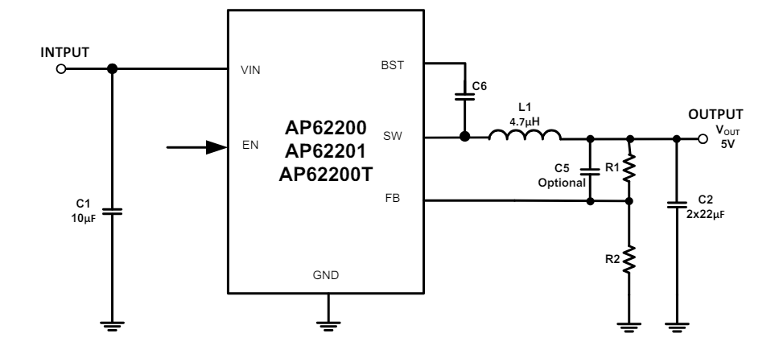
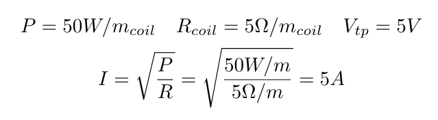
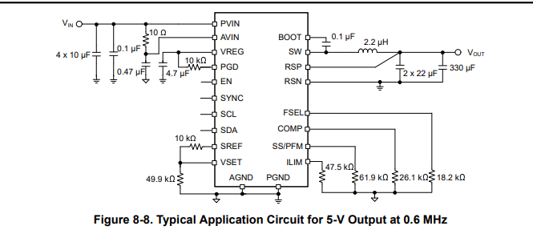
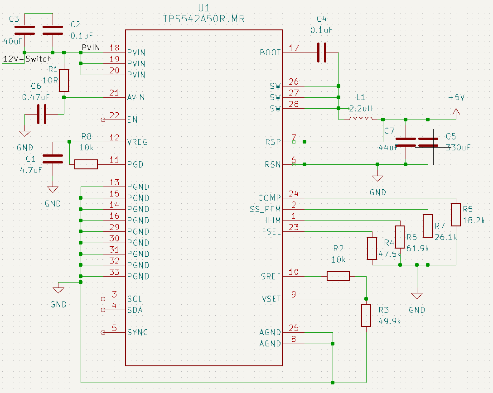
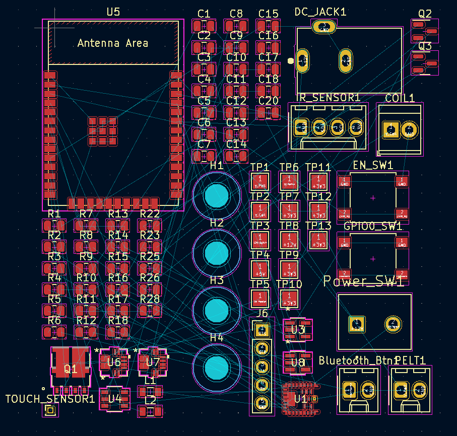
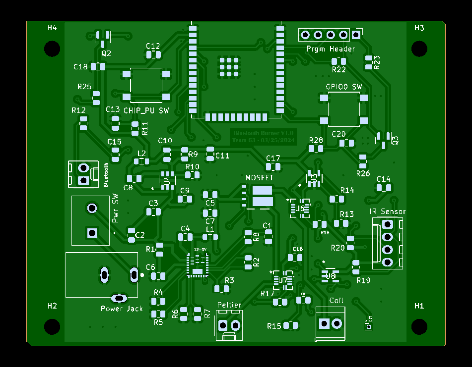
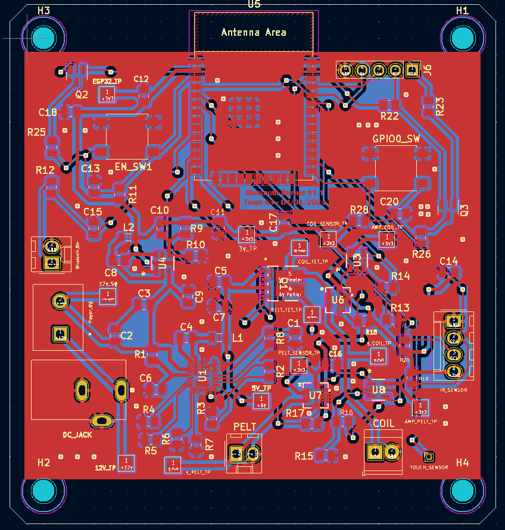
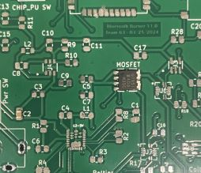
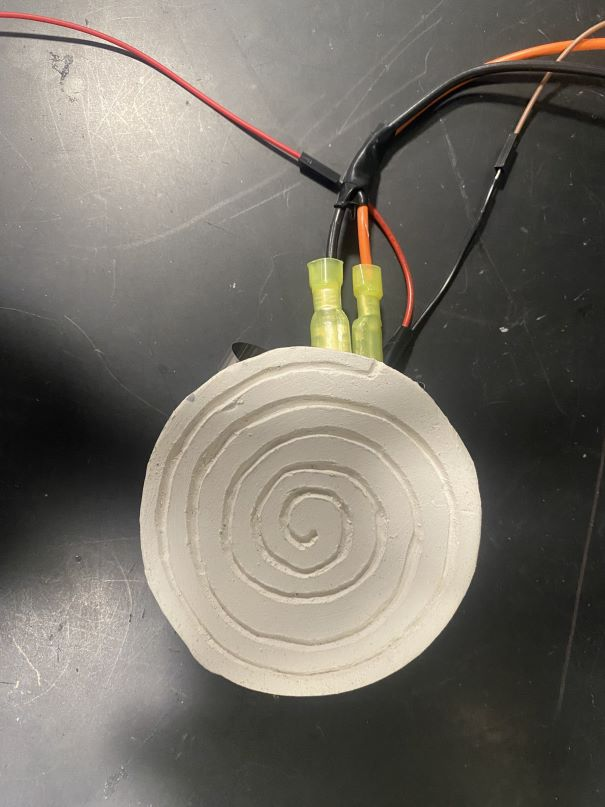
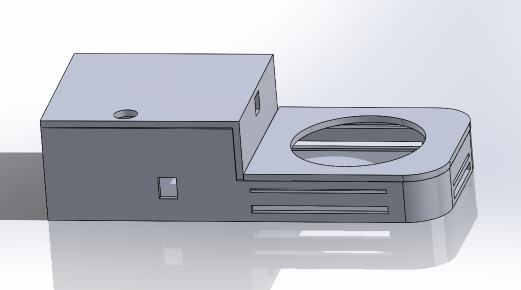

## 2/5/24
We met with our TA Zicheng for the first time today. We decided on meetings at 5:15 every Tuesday there was one scheduled. We have also been working on the proposal a lot. The block diagram is something I am almost done with and I have been pushing it to Github this whole time. The software I am using is draw.io and it linked directly to this repo. I currently have this:

I'm going to need to add more detail to my Block Diagram as it doesn't have the connection types or the pieces of the subsystem. We have still been doing research on the heating subsystem and how we can best power it. I plan to meet with one of the power focused TAs to discuss some options in terms of stepping down a wall-outlet. I also found a few sensors, including an I2C IR Sensor, the MLX90614. This also has a harness for the 4 I2C connections and is on amazon so we can use it easily and get it quickly. The reviews also show it is very easily configured so we may just lock this in. The only concern is how many I2C components we can use. [MLX90614 Non-Contact IR Temperature Sensor](https://www.amazon.com/dp/B071VF2RWM?psc=1&ref=ppx_yo2ov_dt_b_product_details)

## 2/10/24 
## 2/20/24
## 2/27/24
This is an entry after our design review. We are changing a few things following some comments from Professor Gruev. For one I didn't understand low vs high side switching with MOSFETS which meant our original design with a Dual N-Type MOSFET was wrong to use. Instead we are switching to a P-Type MOSFET. I followed this post to understand the concept more: [High Side & Low Side Switching with MOSFETS](https://forum.allaboutcircuits.com/threads/whats-the-difference-between-mosfet-high-side-and-low-side-switching.124664/)

I also decided on a 3.3V converter as the voltage and current requirements are more easily defined for the control and sensor subsystems. For example Bluetooth enabling requires around 600mA of current. The sensors require around 100mA total so as we could I chose a 2A converter so there is ample current. This IC also has a fairly easy schematic without too many complicated passives needed. I included the schematic from the Diodes Incorporated datasheet:

The PCB review is on Friday as well so I plan on attending. I doubt I will be able to get too much but it will be helpful to just have another set of eyes look at our schematics so I can start to make the Layout. I'm trying to finish the PCB but some of the schematics are quite tedious with how many passives are attached to them. The 5V converter we are thinking of using has 15 passives alone.

## 3/5/24
We need to complete our PCB, I have finished some of the schematics in KiCAD but there is still a lot to do. We won't be able to finish before the First Round Order which will be a big issue for our testing and future work. 

So far I have finished the power subsystems and the current subsystems. We ended up going with the TPS542A50RJMR after me and Varun met with Jason at his office hours. The convincing element is that this IC can output up to 15A. So if we can use our 12V 10A adapter from amazon we will have enough power as specified in the below calculations that I screenshotted from our group's Tolerance Analysis in the Design Doc.

The power subsystem was quite complicated and we followed the recommended fixed 5V output on the ICs datasheet:

The subsystem looked like below in the end:

I am going to have to finish the sensor subsystem, but its more related to getting the Op-Amp part of it correct than building all of it. Hopefully I will be able to finish the schematics before spring break but otherwise Navin and Varun will have to work on the PCB instead of me.

## 3/19/24
Currently I am still working on the PCB, I have all the schematics made but I need to route them now. The amount of passives is going to make this a difficult task. The ratsnest has so many different passives that we may have to make a bigger PCB. I had no service all of Spring break which is why I don't have any sessions from then. For the forseeable future I will just have to work through connecting all of these components. 

## 3/26/24
Finished the PCB Layout for the 3rd Round Order, this will be our first finished PCB design. We couldn't do much over spring break as I had no service and the other two did not do any work either. I got a preview from PCBWay which is included below:

I may need to add changes for the 4th round, like adding the solder pads for test points. Also, the 5V converter we chose is going to be much more difficult than I thought. We are going to have to reflow solder these components which will be a pain. I ended up just copying the ESP32 stuff from the website. Especially the BJT's and strapping pin schematics. I have been looking more into the ceramic pad and I think I can reach out to the ceramics lab at Flagg Hall or a professor in Siebel School of Design who can connect me.

## 4/1/24
This session was after I finished the PCB for the 4th round order. This was extremely difficult to route and I ended up using the back layer using a lot of vias. Below is the layout, this time PCBWay didn't give a preview image.

I am a little worried the connector's I chose won't be available but I think its fine since I used the same one's as the original CAD Assignment ones did. They were Molex which I checked and the Self-Help inventory has them, but a weird variety and a lot of housings for some reason. We also don't have the 3rd Round PCBs yet so even though our components are late, we couldn't test them either way. Navin and Varun are doing the software stuff for bluetooth also. I am also in contact with the Ceramics Department and plan to go to the Studio at Allen Hall. Catherine Wisener runs the lab and she was kind enough to invite me there to use the studio so I plan to go there soon. I think I will also check the Self-Help Inventory if they have any ICs we can use to test on the breadboard from our lab kit.

## 4/9/24
Our goal this week was to get code for the control system set up while we waited for the rest of our components to arrive. We have the 3rd round PCBs now as well which is great but we are waiting on some of our components to arrive like the IR sensor, which was lost by the ECE department somehow.

So far most of our progress has been in the Software department with the App being almost done on MITAppInventor and Bluetooth connection already implemented. I also went to the Self-help shop to get some components and passives for testing. I got:
- Heatsinks
- 2 Pin Screw Terminal
- 3 Pin Screw Terminal
- Cable Jack
- Common Passives

Unfortunately they didn't have the TPS542A50RJMR's weird values like 61.9k. So I am going to have to order those, in the meantime I am going to try and find some through-hole ones that are the value I want/close enough to test with. I am going to check how to solder these onto the board but I can just cut the wire short if anything. We also need to get the coil made, which means getting nichrome. A spool costs around $16, its a little weird since this is flat wire but that might be better for us. [Flat Nichrome Wire](https://www.amazon.com/dp/B01E5RBB3I?psc=1&ref=ppx_yo2ov_dt_b_product_details)

## 4/17/24
This was an important session as it was after our mock demo. We are very behind for our final demo and have many things to get done. To start the coming days we have the following to still do:
- Make coil out of wire
- Attach peltier module to heatsink
- Solder 5V converter (hardest one)
- Solder remaining components after testing power from 3.3V converter and 5V
- Start CAD for enclosure and get print done this weekend

 To be honest we are very behind and our 4th round PCBs still haven't arrived causing us some worries. I tried to solder the 5V converter and MOSFET using the reflow oven and it worked well for the MOSFET but the 5V converter did not fare well. It was incredibly small so I bridged some pads and the component even fell off meaning I didn't put enough paste either. I added an image to show how bad it is, the MOSFET is like 6mmx6mm as well. If we had a different stencil it may have worked better. This stack seems like it would have helped earlier, [QFN Package Stencils](https://electronics.stackexchange.com/questions/456021/solder-bridging-when-reflowing-qfp).

 I also started putting the subsystems together on the breadboard and we got some immediate results with the IR Sensor. Me and Varun were able to connect the I2C wires and receive data right away. The Capacitive touch wire also worked but the threshold values could need some tweaking as they are too sensitive. I also went and made the ceramic pad on monday so that will be finished later this week after the kiln firing. The grooves came out well too.

## 4/21/24 - Final Demo Prep
Currently we are in the process of finalizing our project for the final demo. We have many issues with our PCB design with the 5V and 3.3V converters not working so we are testing on a breadboard. The 4th round PCB also came late compared to most of the boards so we didn't have much time to try re-soldering the parts. The coil and peltier module have been connected together but there are some problems with further securing them so we will work on that. Below is what we currently have for the coil as well. We aren't able to get enough power into it for our high-level requirements because our converters are too difficult. The power supply is only 6V-5A and we needed the 10A from our converter. We are still going to show the MOSFET control as that is working on our breadboard. We expect to get maybe 2/3 high-level requirements for the final demo.

I am almost done with the enclosure's CAD model so that we can 3D print it as well. It will be a tight finish because the print's will take a while and may not get done in time, at least all of it. Currently I have this as my enclosure: 

As it stands we have these subsystems working independently:
- Sensor (IR & Capacitive Touch only)
- Power (MOSFET & Spare 3.3V + 5V)
- Heating (Doesn't work due to Power)
- Control 
- Software

We still need to do:
- Integrate code for all subsystems
- Test capacitive touch shutdown and PWM capabilities with app (similar to above)

Basically a lot of multimeter testing on the breadboard to check the 12V's travel to the heating subsystem with app control.

## 4/27/24

